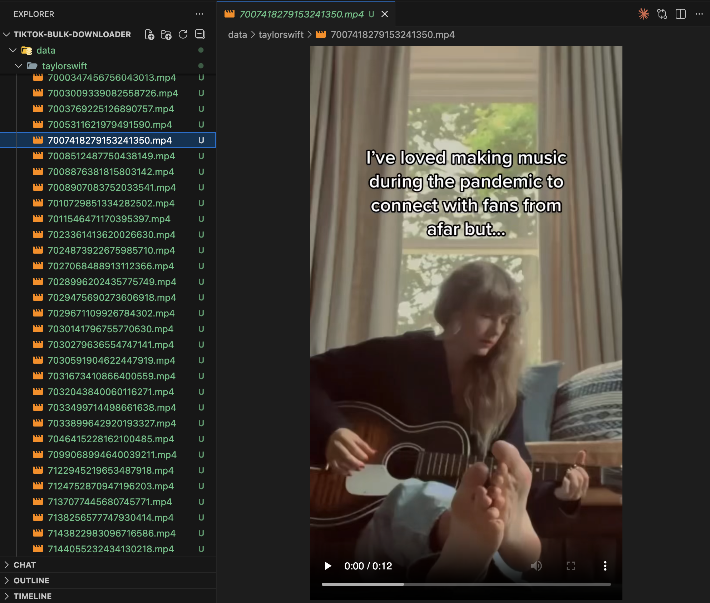

<p align="center">
  
</p>

# Tiktok Bulk Downloader

[](https://github.com/tikfly/tiktok-bulk-downloader/stargazers/)
[](https://github.com/tikfly/tiktok-bulk-downloader/network/)
[](https://twitter.com)
[](https://github.com/tikfly/tiktok-bulk-downloader)
[](https://mit-license.org/)

Bulk download videos and slideshow videos from TikTok user profiles quickly and easily



## Getting Started

### Install requirements
Install the necessary libraries from the `requirements.txt` file
```bash
pip install -r requirements.txt
```

### Configuration
Before running the script, you need to configure some parameters in the `main.py` file. Open this file with a text editor and change the following values:

- `X_API_KEY`: Your API key used to authenticate requests to the Tikfly API. Get it from the official docs: https://docs.tikfly.io/getting-started/quickstart
- `UNIQUE_UD`: Tiktok username of the target account
- `MAXIMUM_NUM_OF_VIDEOS`: The maximum number of videos to download

### Running the Script
Once you have configured the parameters, you can run the script using the following command:

```bash
python main.py
```

### Results
The script will save the downloaded video to `data/{UNIQUE_ID}/{VIDEO_ID}.mp4`.

## Contact

If you have questions, suggestions, or collaboration ideas

Open an issue
Or contact via your preferred channel

